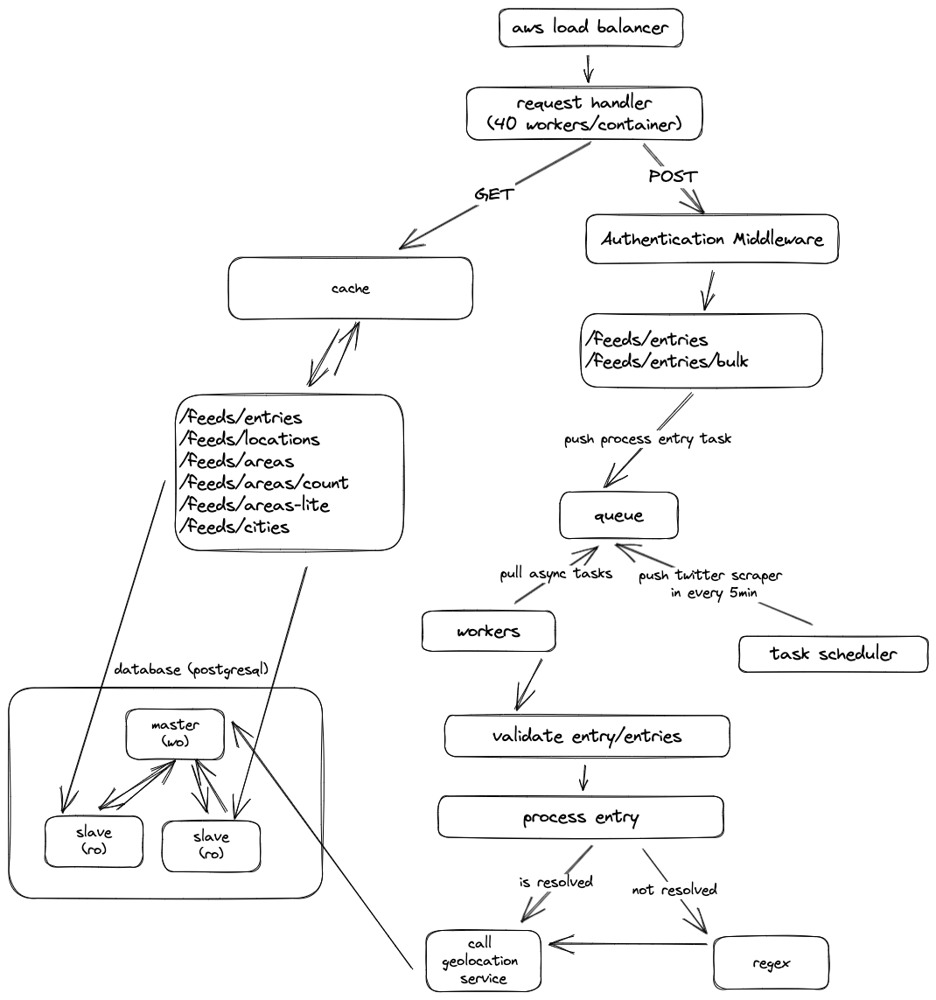

[](https://www.afetharita.com.com) [](https://www.python.org) [](https://www.docker.com) [](https://gl.bg-tek.net/shaman/pentestbx-ets-module) [](https://www.djangoproject.com) [](https://www.djangoproject.com) [](https://www.nginx.com) [](https://redis.com/)
[](https://docs.celeryq.dev/) [](https://aws.amazon.com/) 


# Afet Harita Backend
[ENGLISH VERSION](README.en.md)

https://afetharita.com için back-end projesi. https://api.afetharita.com adresinden erişilebilir.

Diğer projeler: https://github.com/acikkaynak/deprem-yardim-projesi

## Mimari


## Kullanılan teknolojiler

Python (Django), Postgres (PostgreSQL), Redis, AWS (Elastic Load Balancer, ECS, AWS Fargate), OpenAI (Görsellerin metine çevirilmesi)

# Projeyi çalıştırmak

## Bağımlılıklar:

[Docker](https://www.docker.com) (opsiyonel): Geliştirmek için şart değilse de gereksinimleri yüklemeyi ve geliştirme yapmayı kolaylaştıracaktır. Canlıda proje docker üzerinde AWS ECS'lerde çalışmaktadır.

[PostgreSql](https://www.postgresql.org): Veritabanı olarak kullanılmaktadır. Adresten doğrudan bilgisayarınıza indirebilir ya da [docker imajını](https://hub.docker.com/_/postgres) kullanabilirsiniz.

[Redis](https://redis.io): Asenkron Celery görevleri için kuyruk ve cache olarak kullanılmaktadır. Doğrudan bilgisayarınıza indirebilir (Linux için) ya da [docker imajını](https://hub.docker.com/_/redis) kullanabilirsiniz. Windows'ta son versiyon doğrudan çalışmadığı için WSL ile docker'da çalıştırmak en iyi seçenek.

## Geliştirme ortamının hazırlanması

```sh
git clone https://github.com/acikkaynak/deprem-yardim-backend.git
```

Docker yükledikten sonra tüm projeyi docker-compose ile çalıştırmak için

```sh
docker-compose up --build -d
```

Geliştirme için sadece postgres ve redisi ayağa kaldırmak için:

```sh
docker-compose up -d database redis
```

## Python

Python bağımlılık yönetimi poetry ile sağlanmaktadır.

```
pip install poetry
poetry install
```

ile gerekli paketleri yükleyebilirsiniz. Poetry kendi ortamını oluşturup paketleri oraya yükleyecektir.

Daha sonra ortam değişkenlerini ayarlayın. .env.template dosyasını .env adıyla kopyalayıp gerekli ayarları yapın. Compose'dan gelen örnek ayarlarla aşağıdaki gibi olacaktır:

```sh
DJANGO_SECRET_KEY= # django için secret-key
POSTGRES_PASSWORD=debug
POSTGRES_USER=debug
POSTGRES_DB=debug
POSTGRES_HOST=trquake-database
POSTGRES_PORT=5432
CELERY_BROKER_URL=trquake-redis
ZEKAI_USERNAME= # zekai.co kullanıcı adı
ZEKAI_PASSWORD= # zekai.co şifre
DEFAULT_ADMIN_PASSWORD= # ilk oluşturulan admin kullanıcısı için şifre
```

Django Secret key oluşturmak için:

```sh
python
>>> from django.core.management.utils import get_random_secret_key
>>> print(get_random_secret_key())
```

Projeyi development modunda açmak için:

```sh
django-admin migrate
django-admin createsuperuser
django-admin collectstatic --no-input
django-admin runserver
```

Celery için geliştirilen taskları çalıştırmak için:

```sh
celery -A trquake.celery.app worker -B -l DEBUG
```